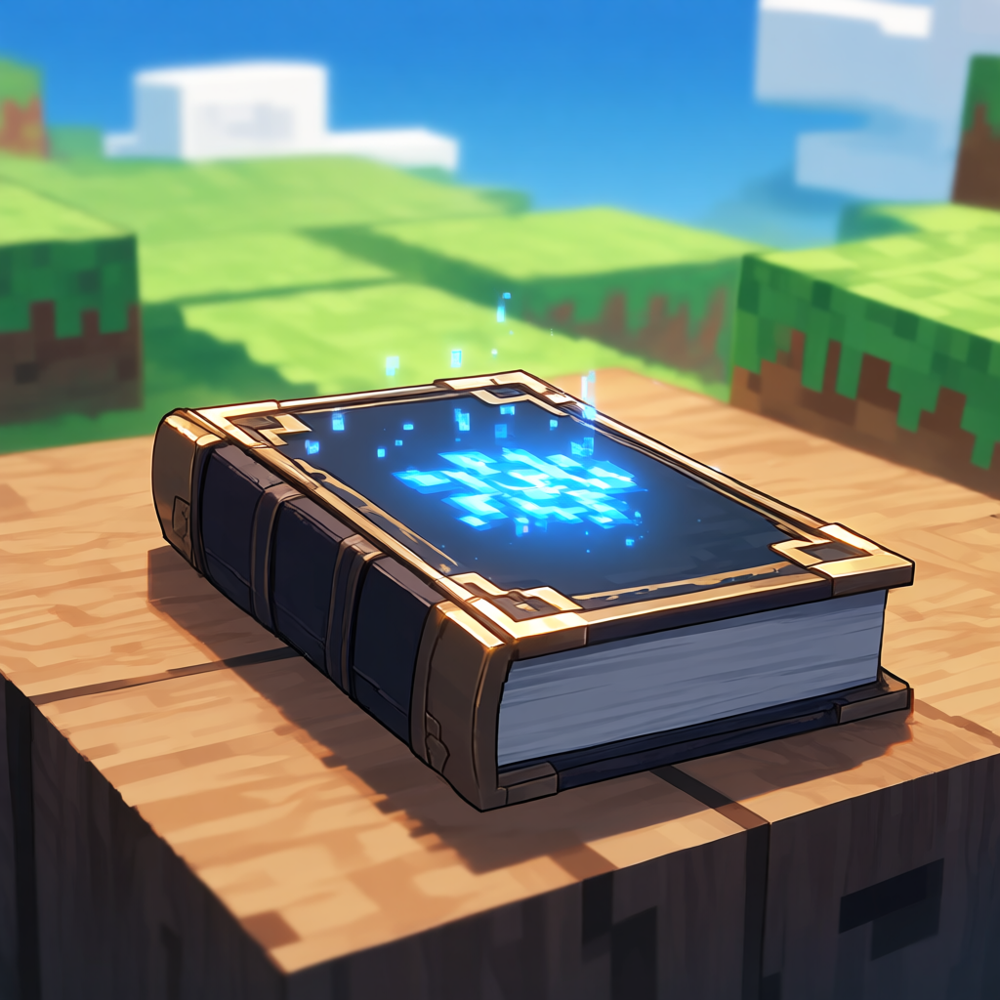

# Melnus's CraftBook

A Minecraft Bedrock Add-on that completely reimagines survival progression by turning cobblestone into the foundation of an entire alchemical crafting system.

This add-on enables players to generate almost every major resource through a structured crafting tree, making it possible to progress from a single block of cobblestone to endgame materials like Netherite.

---

## Overview

Melnus's CraftBook is a progression overhaul add-on inspired by skyblock-style gameplay and alchemy systems.

Instead of relying on exploration or loot generation, all resources are obtained through a chain-based crafting system, starting from basic blocks and expanding into a full resource economy.

The core idea is simple:

> Everything begins with cobblestone.

---

## Core Features

### 🪨 1. Resource Evolution Chain

Basic blocks evolve into more complex materials through crafting chains:

Cobblestone → Gravel → Sand → Dirt → Moss Block

Dirt → Seeds → Crops → Food → Experience Bottles

Moss Block + Bone Meal → Expansion of natural resources

---

### ⚗️ 2. Experience Bottle as a Catalyst

Experience Bottles act as a core alchemical reagent used in advanced crafting recipes.

They are used to:

Upgrade ores

Create rare materials

Transform base resources into advanced items

---

### ⛏️ 3. Ore Transmutation System

A custom progression system replaces traditional mining progression:

Copper → Iron → Gold → Diamond → Netherite (via experience-based crafting)

This allows full progression without requiring natural ore generation.

---

### 🌱 4. Life Generation System

Players can create biological resources through crafting:

All saplings can be crafted from basic materials

Animals and villagers can be created via spawn egg recipes

Food and crops can be regenerated infinitely

---

### 🧪 5. Expanded Utility Crafting

Many normally non-craftable items can now be produced:

- Water & Lava buckets

- Blaze rods

- Tridents

- Sponge

- Gunpowder

- String, leather, and more

---

## Example Recipes

- Potato + Carrot → Experience Bottle ×20

- Cobblestone + Cobblestone → Gravel
- Gravel + Gravel → Sand
- Sand + Sand → Dirt
- Dirt + Dirt → Moss Block
- Moss Block + Bone Meal → Wheat Seeds ×12

- Stick + Wheat Seeds → Carrot ×12
- Wheat + Stick → String ×2
- String + Stick → Wool ×6

- Experience Bottle + Iron + Copper → Redstone ×16
- Iron + Experience Bottle → Gold Ingot ×6
- Gold + Experience Bottle → Diamond ×6
- Diamond + Gold + Experience Bottle → Netherite Ingot ×4

---

## Design Philosophy
  
This add-on is designed around three core ideas:

**Everything is craftable**  
**Progression is linear and deterministic**  
**Survival is about transformation, not exploration**  
  
It removes dependency on world generation and replaces it with a fully player-driven resource economy.  

---

## Intended Gameplay Style

- Skyblock-style survival
- Minimal exploration
- Heavy crafting progression
- Resource automation potential (optional)

---

## Compatibility

Minecraft Bedrock Edition (1.20+)
Works best in survival or skyblock environments
Designed as a standalone progression overhaul

---

## Notes

This add-on is experimental and may contain balance issues due to its extreme progression flexibility. It is intended as a sandbox for alternative survival systems rather than a balanced vanilla replacement.

---

## License

Free to use, modify, and distribute with credit to Melnus.
